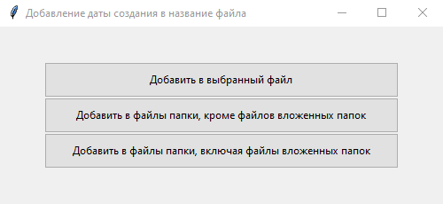
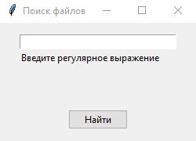
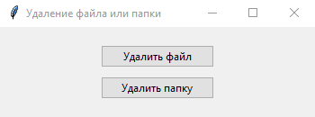

## 
Графический интерфейс FAF менеджера

### 
Запуск графического интерфейса

Для запуска графического интерфейса запустите командную строку 
и перейдите в каталог (папку) с файлами проекта.
В командной строке введите <b>py GUI.py</b>, или <b>python GUI.py</b>, 
или <b>python3 GUI.py</b> в зависимости от установленной версии или установленных версий Python.
На экране должно появиться главное окно приложения (<i>Изображение 1</i>).

#### 
Изображение 1. Главное окно приложения

1 - Прокручиваемый текстовый виджет;  
2 - Кнопка для очистки прокручиваемого текстового виджета;  
3 - Кнопка для вызова функции, которая делает анализ папки, всех вложенных папок и файлов;  
4 - Кнопка вызова окна для вызова одной функции из группы функций 
для добавления даты создания в имя файла или в имена файлов;  
5 - Кнопка для вызова функции для подсчета количества файлов в папке, включая вложенные;  
6 - Кнопка для вызова функции копирования файла;  
7 - Кнопка для вызова функции поиска файлов в папке с помощью регулярных выражений;  
8 - Кнопка вызова окна для вызова функции удаления файла или папки;  
9 - Кнопка для закрытия окна приложения.  

### 
Использование графического интерфейса

#### 
Текстовый виджет прокручиваемый

Прокручиваемый текстовый виджет (1, <i>Изображение 1</i>) при вызове команд и в результате их 
выполнения отображает пользователю поток вывода и поток ошибок, если последние возникнают. 
У текстового виджета имеются две полосы прокрутки:
прокрутка по вертикали и прокрутка по горизонтали. 
Для очистки прокручиваемого текстового виджета необходимо щелкнуть по кнопке 
"Очистить" (2, <i>Изображение 1</i>).

#### 
Кнопка "Анализ папки"

Кнопка "Анализ папки" (3, <i>Изображение 1</i>) при ее нажатии вызывает диалоговое окно 
"Выберите папку для анализа". Пользователю необходимо выбрать папку, для которой необходимо 
сделать анализ. 
В результате выполнения функции, в текстовый прокручиваемый виджет (1, <i>Изображение 1</i>) 
будут выведены имя и рамер выбранной папки, имена и размеры вложенных папок, а также 
имена и размеры всех вложенных файлов.

#### 
Кнопка "Добавить дату создания"

Кнопка "Добавить дату создания" (4, <i>Изображение 1</i>) при ее нажатии вызывает окно 
"Добавление даты создания в название файла" (см. <i>Изображение 2</i>).

#### 
Изображение 2. Окно "Добавление даты создания в название файла"

Для выбора одного из трех вариантов пользователю необходимо нажать соответствующую кнопку. 
В результате выполнения одной из функций, в текстовый прокручиваемый виджет 
(1, <i>Изображение 1</i>) будет выведено сообщение о добавлении даты создания 
в название файла или в названия файлов с указанием пути выбранного файла или выбранной папки.

#### 
Кнопка "Количество файлов"

Кнопка "Количество файлов" (5, <i>Изображение 1</i>) при ее нажатии вызывает диалоговое окно 
"Выберите папку для подсчета количества файлов". Далее пользователю необходимо выбрать папку, 
для которой будет произведен подсчет количества файлов, содержащихся в ней. 
В результате выполнения функции, в текстовый прокручиваемый виджет (1, <i>Изображение 1</i>) 
будет выведено сообщение, содержащее указании пути выбранной пользователем папки 
и указанием количества файлов в ней.

#### 
Кнопка "Копировать файл"

Кнопка "Копировать файл" (6, <i>Изображение 1</i>>) при ее нажатии вызывает диалоговое окно 
"Выберите файл для копирования". Далее пользователю необходимо выбрать файл, которой будет 
скопирован и нажать кнопку "Открыть". 
После выбора файла откроется диалоговое окно "Выберите путь для копии файла, введите имя 
и тип файла". Необходимо выбрать путь, ввести имя копии файла и <i>обязательно после имени 
для копии файла ввести через точку тип файла</i>, например, <i>.txt</i>, если копируемый файл 
такого типа, и нажать кнопку "Сохранить". 
В результате выполнения функции, в текстовый прокручиваемый виджет (1, <i>Изображение 1</i>) 
будет выведено сообщение о том, что файл расположенный по следующему пути 
(путь указанный к копируемому файлу) скопирован в указанный путь (путь для копии файла).

#### 
Кнопка "Поиск файлов"

Кнопка "Поиск файлов" (7, <i>Изображение 1</i>) при ее нажатии вызывает диалоговое окно 
"Выберите папку для поиска файлов". Пользователю необходимо выбрать папку, в которой будет 
осуществлен поиск и нажать кнопку "Выбор папки". После выбора папки откроется окно 
"Поиск файлов", представленное на <i>изображении 3</i>.

#### 
Изображение 3. Окно "Поиск файлов"

В поле для ввода текста с текстовой меткой снизу "Введите регулярное выражение" 
(см. <i>Изображение 3</i>) пользователю необходимо ввести регулярное выражение, по которому будет 
осуществлен поиск файлов, и нажать кнопку "Найти". 
В результате выполнения функции, в текстовый прокручиваемый виджет (1, <i>Изображение 1</i>) 
в случае нахождения будут выведены найденные файлы.

#### 
Кнопка "Удалить"

Кнопка "Удалить" (8, Изображение 1) при ее нажатии открывает окно 
"Удаление файла или папки" (Изображение 4).

#### 
Изображение 4. Окно "Удаление файла или папки"

Пользователю необходимо выбрать один из вариантов для вызова функции и нажать 
соответствующую кнопку (см. <i>Изображение 4</i>). 
При нажатии на кнопку "Удалить файл", вызовется диалоговое окно "Выберите файл для удаления". 
Далее необходимо выбрат файл, который будет удален, и нажать кнопку "Открыть". 
В результате выполнения функции удаления файла, в текстовый прокручиваемый виджет 
(1, <i>Изображение 1</i>) будет выведено сообщение о том, что файл по указанному 
пользователем пути удален. 
При нажатии на кнопку "Удалить папку", вызовется диалоговое окно "Выберите папку для удаления". 
Далее необходимо выбрать папку, которая будет удалена, и нажать кнопку "Выбор папки". 
В результате выполнения функции, в текстовый прокручиваемый виджет (1, <i>Изображение 1</i>) 
будет выведено сообщение о том, что папка по указанному пользователем пути удалена.

#### 
Кнопка "Выход"

Кнопка "Выход" (9, <i>Изображение 1</i>) при ее нажатии закрывает главное окно приложения 
и все остальные окна приложения, если они были открыты.

