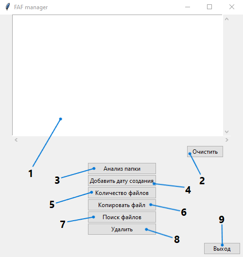

## 
Графический интерфейс FAF менеджера

### Запуск графического интерфейса
Для запуска графического интерфейса запустите командную строку 
и перейдите в каталог (папку) с файлами проекта.
В командной строке введите **py GUI.py**, или **python GUI.py**, 
или **python3 GUI.py** в зависимости от установленной версии или установленных версий Python.
На экране должно появиться главное окно приложения (изображение 1).

#### 
Изображение 1. Главное окно приложения

1 - Прокручиваемый текстовый виджет;  
2 - Кнопка для очистки прокручиваемого текстового виджета;  
3 - Кнопка для вызова команды analysis;  
4 - Кнопка вызова окна для вызова одной из команд группы команд add_date;  
5 - Кнопка для вызова команды count;  
6 - Кнопка для вызова команды copy;  
7 - Кнопка для вызова команды find;  
8 - Кнопка для вызова команды delete;  
9 - Кнопка для закрытия окна приложения.  

